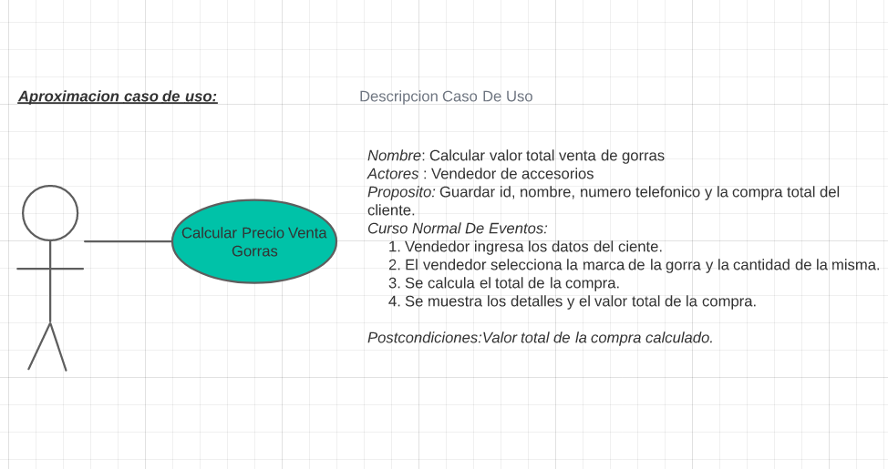

# Ejercicio venta de gorras
*En su trabajo como desarrollador ha sido elejido para el desarrollo de una aplicacion que necesita un comerciante del centro de la ciudad, que desea calcular el valor de una venta de accesorios (gorras) de esta manera determinar el valor total de la compra, de esta manera hacer mas eficiente el calculo de las ventas y hacer las ventas mas efectivas.*
*Como informacion basica el empleado debe seleccionar la marca de las gorras y la cantidad, el nombre el cliente y el numero de telefono*

**Aclaraciones**

1.Se supondra que la aplicacion solo requiere calcular el valor total y los productos de una venta.

2.Para efectos de mantener la simplicidad del ejemplo no se contemplan manejar persistencia en el almacenamiento de los datos.

3.No se realiza validacion, ni se verifica la calidad de los datos ingresados.

## HISTORIA DE USO

## CASO DE USO

## APROXIMACION DIAGRAMA DE FLUJO

